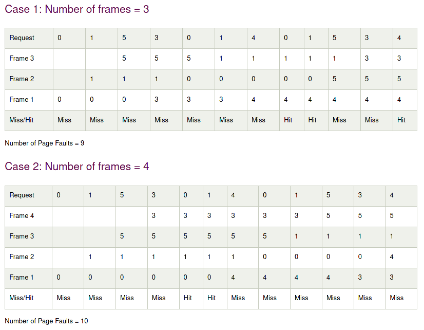

[HOME](../)

 
# Top 10 List of Week 05

Author's Note: Whoops, seems like I mistakenly set the permalink for last week's weekly top 10 list as WXX, it's fixed now, but hopefully that didn't cause any major problems.
 

1. [Virtual Memory](https://www.tutorialspoint.com/operating_system/os_virtual_memory.htm) 
As it so happens, I may have gotten ahead of myself and mentioned this topic in the previous weekly top 10 lists. However! This week we thoroughly explore it in this course, so I'll take the liberty of including this topic once again. To put it simply, virtual memory is a storage allocation scheme in which the computer's non-volatile storage is used as if it were part of main memory. This is especially useful when a program requires more memory than the computer can physically provide. Not only that, memory virtualization also grants us memory protection, since each virtual address is translated into a physical address.

2. [Virtual Address Space](https://en.wikipedia.org/wiki/Virtual_address_space) 
The virtual address space is a set of virtual addresses that correspond to a location in physical memory. This virtual address space is entirely self-contained, and is not shared by other applitions. This grants us the benefit of process isolation, which means each process is protected from each other as they cannot access the same virtual address space.

3. [Demand Paging](https://www.tutorialspoint.com/operating_system/os_virtual_memory.htm) 
Demand paging is similar to swapping, which I've mentioned earlier. The difference is, the processes involved in Demand Paging reside in secondary memory, and pages are loaded only on demand, not in advance. Demand paging is achieved via a page table implementation. This table maps logical memory to physical memory, and in the event of a context switch the operating system executes the new program after loading the first page, then fetches the remaining pages as they are referenced.

4. [Page Faults](https://www.geeksforgeeks.org/page-fault-handling-in-operating-system/) 
When a program tries to access data that is within its address space, but is not available in physical memory, a page fault occurs. Since physical memory is often smaller than virtual memory, these page faults have the potential to occur. In the case of a page fault the Operating System will have to rely on certain page replacement algorithms to replace one of the existing pages.

5. [Page Replacement Algorithms](https://www.geeksforgeeks.org/page-replacement-algorithms-in-operating-systems/) 
There are various algorithms to handle page faults. The different algorithms decide which page to replace. The target for all of these algorithms is to reduce the number of page faults.
* First In First Out (FIFO):
    The simplest algorithm out of all of them, the FIFO algorithm places pages in the memory into queue. When a page has to be replaced, the page in the front of the queue (the oldest page) is selected for removal.
* Optimal Page replacement:
    This algorithm replaces the page that is expected not to be used for the longest duration of time in the future.
* Least Recently Used:
    In which the least recently used page is replaced by the new page

6. [Belady's Anomaly](https://www.javatpoint.com/os-beladys-anamoly) 
Belady's anomaly is an unusual behaviour that occurs in the the FIFO page replacement algorithm.
    
    example courtesy of https://www.javatpoint.com/os-beladys-anamoly
In this example, as the number of frames increase, so does the number of page faults. This is not necessarily the case in every instance of a FIFO page replacement algorithm. Stack based algorithms, however, do not suffer from this anomaly, as these algorithms assigns priority to a page for replacement that is independent to the number of page frames.

7. [Frame Allocation](https://www.geeksforgeeks.org/operating-system-allocation-frames/) 
* Equal Allocation: In which a system's individual processes get an equal number of frames. A disadvantage of this allocation scheme is that in reality, the system may have processes with varying sizes, which do not properly get accomodated by such allocation scheme.
* Proportional Allocation: In which a sytems's frames are allocated to eah process according to its process size. For a process of a certain size, the number of allocated frames equals the size of the process divided by the sum of the sizes of all processes in the system, then multiplied with the number of frames available in the system.

8. [Global vs Local Allocation](https://www.geeksforgeeks.org/operating-system-allocation-frames/) 
* Local Replacement: When a process requests a page which is not within the system's memory, it can bring in the new page and allocate a frame for it from its own set of allocated frames. This has the advantage of having the pages in memory and its fault ratio being affected by only that process. However, with this scheme, low priority processes may hinder higher priority processes when they require more frames for their own set.
* Global Replacement: This replacement scheme, on the other hand, allocateds new frames for a new page from the set of all frames, even if that frame is currently allocated to some other process. This grants us the advantage of having the performance of processes unhindered and thus results in higher system throughput. However, this scheme suffers from having the page fault ratio of a process not being solely controlled by the process itself.  

9. [Copy on Write (COW)](https://www.geeksforgeeks.org/copy-on-write/) 
Copy on Write is a resource management technique which is implemented is UNIX-like operating systems in the fork system call. This call creates a duplicate process of the parent process. This is done so that when any of the ongoing processes attempt to modify the shared pages, the modifications are done on a copy of these pages, and will not affect the other process.

10. [What Else Did I Learn This Week?](https://en.wikipedia.org/wiki/Systemd) 
During my regular internet deep dives, I came across something called systemd (read: System D). Apparently this is a bit of a contentious topic for some linux users. systemd is one of many init systems available in the UNIX-based OS ecosystem. Init systems play a role during the boot process, where it is the first process started by the system after the kernel starts. Furthermore, the init system must start all the necessary daemons (don't be scared, these are just names for background processes) that are required to make the operating system work. systemd is the init system that is utilized in most mainstream linux distributions today, though some users have voiced their dislike for this fact. While I may not fully understand it now, I might look a bit more into this, as it seems like a pretty important part in operating systems: at least, linux, anyway.